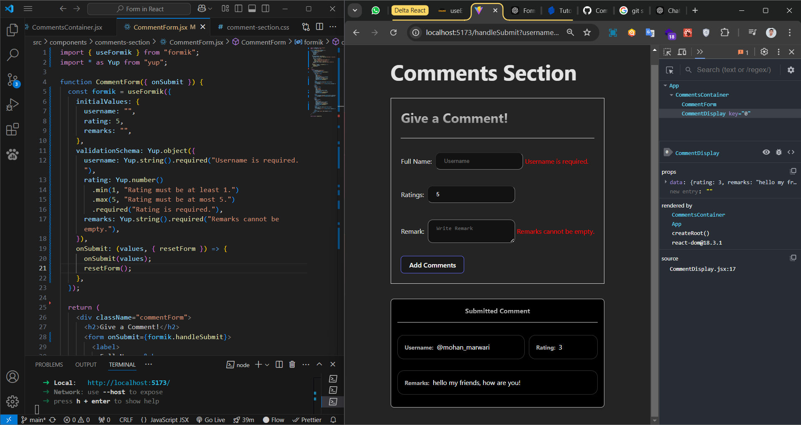

# Product Store

This is a simple React-based product store project created for learning purposes. It showcases a product listing page with modern styling and basic functionality.

## Features
- A responsive and clean UI for product display.
- Display of product details including name, description, original price, and discounted price.
- Built with React and Vite for fast performance and developer experience.

## Screenshots


## Technologies Used
- **React**: A JavaScript library for building user interfaces.
- **Vite**: A modern build tool for lightning-fast development.
- **CSS**: Used for styling the components.

## How to Run the Project
To run this project on your local machine, follow these steps:

1. **Clone the Repository**

   `git clone https://github.com/your-username/product-store.git`

2. **Navigate to the Project Directory**

    `cd product-store`

3. **Install Dependencies**

    `npm install`

4. **Start the Development Server**

    `npm run dev`

5. **Open in Browser** Open your browser and navigate to:

    `http://localhost:5173`

## Folder Structure

```
product-store/
├── public/
├── src/
│   ├── components/       # Reusable React components
│   ├── App.jsx           # Main App component
│   ├── main.jsx          # Entry point for React
│   └── styles/           # Custom CSS styles
├── package.json          # Project configuration and dependencies
└── README.md             # Project documentation
```

## Learning Objectives
This project was created to:

- Understand the basics of React and component-based architecture.
- Learn how to integrate Vite with React for fast development.
- Practice creating reusable components and styling them effectively.

## Future Improvements
- Add more functionality like product filtering or sorting.
- Integrate a backend for dynamic product data.
- Enhance UI/UX with animations or advanced styling.

## Contributing
Contributions are welcome! If you'd like to contribute, please fork the repository and create a pull request.