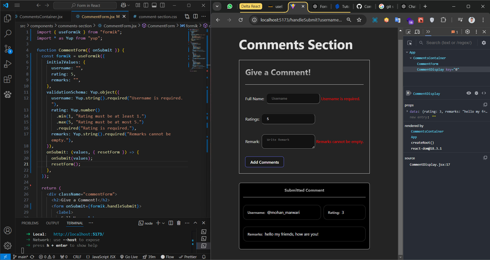

# Comments Form Application

This project is a React-based application that allows users to submit comments, including their username, rating, and remarks. Submitted comments are displayed below the form in a styled manner.

---

## ✨ Preview:


## Features

1. **Submit Multiple Comments**:
   - Users can submit multiple comments.
   - Each submitted comment is displayed in a list below the form.

2. **Form Functionality**:
   - Inputs for username, rating (1-5), and remarks.
   - Form resets after submission.

3. **Dynamic Display**:
   - Submitted comments appear dynamically without refreshing the page.

4. **Styling**:
   - Clean and modern design for displaying comments.

## Components

### `CommentsContainer`
The parent component that manages the state of the application.
- **Responsibilities**:
  - Maintains a list of comments in state.
  - Handles submission of new comments.
  - Passes data to child components.

### `CommentForm`
The component that renders the form and handles user input.
- **Props**:
  - `onSubmit`: Callback function to pass form data to the parent.
- **State**:
  - Tracks user input for username, rating, and remarks.

### `CommentDisplay`
The component that renders a single comment.
- **Props**:
  - `data`: The comment object containing username, rating, and remarks.
- **Styling**:
  - Includes a bordered container with padding and shadow for better visibility.

## File Structure
```
.
├── src
│   ├── CommentsContainer.jsx
│   ├── CommentForm.jsx
│   ├── CommentDisplay.jsx
│   └── index.css
└── README.md
```

## Example Workflow
1. User enters their name, a rating, and a remark in the form.
2. On clicking the "Add Comments" button:
   - The form data is passed to the `CommentsContainer`.
   - A new comment is added to the list of comments in the state.
   - The `CommentForm` resets its fields.
3. The new comment appears dynamically below the form in the `CommentDisplay`.

## Installation and Usage

1. Clone the repository:
   ```bash
   git clone <repository-url>
   ```

2. Navigate to the project directory:
   ```bash
   cd comments-form-app
   ```

3. Install dependencies:
   ```bash
   npm install
   ```

4. Start the application:
   ```bash
   npm start
   ```

5. Open your browser and navigate to:
   ```
   http://localhost:3000
   ```

## Stylesheet
The main CSS file (`index.css`) includes styles for the components. Additional styles for the `CommentDisplay` component are included directly in the component.

## Future Enhancements
- Add a delete button for each comment.
- Integrate a backend to persist comments.
- Improve form validation.

## License
This project is licensed under the MIT License.

---

Enjoy building and enhancing this simple comments application! 🎉
