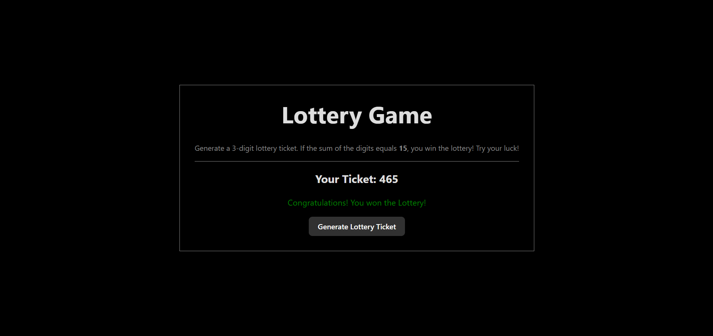

# React Lottery Game 🎲

A simple and fun lottery game built with React! This project demonstrates the use of React components, state management, and event handling to create an interactive application.

---

## 🎮 How to Play:
1. Click the "Generate Lottery Ticket" button.
2. A random 3-digit ticket is generated.
3. If the sum of the ticket digits equals 15, you win! 🎉 Otherwise, try again.

## 🛠 Features:
- Random 3-digit ticket generation.
- Real-time sum calculation and result display.
- Styled with inline CSS for simplicity.

## 🚀 Getting Started:
### Prerequisites
- Node.js installed
- A code editor like VS Code

### Installation
1. Clone the repository:
   ```
   git clone <repository-url>
   ```
2. Navigate to the project directory:
   ```
   cd react-lottery-game
   ```
3. Install dependencies:
   ```
   npm install
   ```
4. Start the development server
   ```
   npm start
   ```

## 📂 Project Structure:
```
src/
├── components/
│   ├── Button.jsx
│   ├── Info.jsx
│   ├── Message.jsx
│   ├── Ticket.jsx
│   └── LotteryGame.jsx
├── App.jsx
├── App.css
├── index.js
```

## ✨ Preview:


## 🖋 Author:
Developed with 💙 by Mohan Marwari